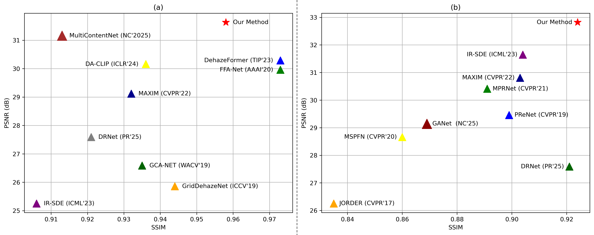

# SR-Diff: Semantic-Guided Diffusion for High-Fidelity Image Restoration
Image restoration, a pivotal challenge in computer vision, aims to recover high-fidelity visuals from degraded inputs. Traditional methods often falter under complex degradations due to a lack of high-level semantic reasoning. Addressing this, we introduce SR-Diff, a diffusion-based framework that integrates semantic priors from vision-language models (VLMs) to guide the restoration process. By refining semantic embeddings through a Semantic Refinement Module, SR-Diff ensures robust guidance with minimal computational overhead. Experiments on dehazing, deraining, motion deblurring, and low-light enhancement demonstrate SR-Diff's superiority over state-of-the-art methods, achieving significant improvements in both quantitative metrics and perceptual realism. Here, we show that semantic guidance enhances restoration fidelity, particularly in complex scenes, marking a substantial advancement in image restoration technology.

[Qiang Zhu],
[Zhibo Wang],
[Mengyao Wang],
[Jiaxing Hu],
[Yuguo Wu]

## Some Results
<p align="center">
  
</p>

<div align='center'> (a) Quantitative comparison on the RESIDE-6K dataset for image dehazing. (b) Quantitative comparison on the Rain100H dataset for image deraining.</div>


<p align="center">
  
</p>

<div align='center'>Qualitative dehazing results on RESIDE-6K. LQ denotes the hazy input image; GT denotes the ground truth.</div>


<p align="center">
  

</p>

<div align='center'>Qualitative low-light enhancement results on LOL. LQ denotes the low-light input, and GT denotes the ground truth.</div>


<p align="center">
  
</p>

<div align='center'>Qualitative motion deblurring results on the GoPro dataset. LQ denotes the motion-blurred image; GT denotes the ground truth.</div>


<p align="center">
  
</p>

<div align='center'>Qualitative single-image deraining results on the Rain100H dataset. LQ denotes the rain-corrupted input, and GT represents the ground truth.</div>

## How to run the code?

### Dependencies
* nvidia:
  - cuda: 11.4
* python 3.8
### Install
This project is implemented in Python 3.8 and relies on several deep learning and computer vision libraries.
Before running the code, please ensure that a compatible CUDA environment is properly installed on your system.

We recommend using a virtual environment (e.g., conda or venv) to avoid dependency conflicts.
```bash
pip install -r requirements.txt
```
### Dataset Preparation
Preparing the train and test datasets following our paper Dataset Construction section as:

```bash
#### for training dataset ####
datasets/train
|--hazy
|  |--LQ/*.png
|  |--GT/*.png
|  |--LQCLS/*.pt
|  |--RestoreCLS/*.pt
|--low-light
|--rainy
|--motion-blurry
```


#### Dataset Links
| Degradation |                                  motion-blurry                                  |                                                 hazy                                                 |                                                  rain                                                 |                                   low-light                                   |             
|-------------|:-------------------------------------------------------------------------------:|:----------------------------------------------------------------------------------------------------:|:-----------------------------------------------------------------------------------------------------------------:|:-----------------------------------------------------------------------------:|
| Datasets    | [Gopro](https://drive.google.com/file/d/1y4wvPdOG3mojpFCHTqLgriexhbjoWVkK/view) | [RESIDE-6k](https://drive.google.com/drive/folders/1XVD0x74vKQ0-cqazACUZnjUOWURXIeqH?usp=drive_link) | [Rain100H](https://www.kaggle.com/datasets/bshaurya/rain-dataset?utm_source=chatgpt.com) | [LOL](https://drive.google.com/file/d/157bjO1_cFuSd0HWDUuAmcHRJDVyWpOxB/view) | 

#### for testing dataset ####
#### (the same structure as train) ####
datasets/val
...


### Training
#### Semantic Refinement Module
This stage focuses on semantic extraction and refinement.
We first extract semantic embeddings from low-quality (LQ) images and their corresponding ground-truth (GT) images using a vision-language model. These paired semantic representations are then used to train the Semantic Refinement Module, which aims to align degraded-image semantics with clean-image semantics.

This module serves as a lightweight yet effective semantic enhancer and will later be frozen and used to guide the diffusion-based restoration model.
```bash
###Enter the sr/ directory:
cd sr/
###Extract semantic embeddings for low-quality (LQ) and ground-truth (GT) images:
python getCLS.py 
###Train the semantic enhancement module:
python train.py 
```
#### Image Restoration
This stage corresponds to the main image restoration framework.
It implements a score-based diffusion model (SDE formulation) and integrates the refined semantic embeddings as conditional inputs to guide the reverse diffusion process.

During training, the previously trained Semantic Refinement Module is fixed, and only the diffusion model parameters are optimized.
```bash
###Enter the ir/ directory:
cd ir/
python train.py -opt options/train.yml

```
### Evaluation
To evalute our method on image restoration, please modify the benchmark path and model path and run
Pretrained model weights for the experiments are available at the following link: [Download](https://drive.google.com/drive/folders/1Qbch30zXO_zr6EgUkN8ZkSsRI6-VJRsg?usp=sharing)


```bash
cd ir/
python test.py -opt options/test.yml
```

### Notes

1. Send e-mail to zhuqiang1017@foxmail.com if you have critical issues to be addressed.
2. Please note that there exists the slight gap in the final version due to errors caused by different testing devices and environments.


